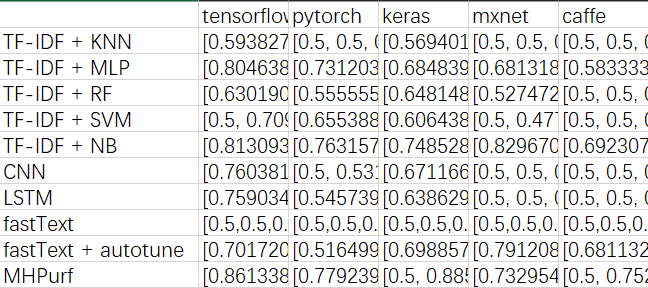

# Multifaceted Hierarchical Performance Bug Report Identification for Deep Learning Projects

<!-- ABOUT THE PROJECT -->
## About The Project
This online appendix is supplementary to the paper entitled "Multifaceted Hierarchical Performance Bug ReportIdentification for Deep Learning Projects".. It contains the raw results, code for the proposed approach, and Colab script to replicate our experiments.

This README file describes the structure of the provided files (Raw data, source code and results). as well as information on the content of this repository.

## Table of Content
<!-- TABLE OF CONTENTS -->
<details open="open">
  <summary></summary>
  <ol>
    <li>
      <a href="#about-the-project">About The Project</a>
    </li>
    <li>
      <a href="#Table of Content">Table of Content</a>
    </li>
    <li>
      <a href="#getting-started">Getting Started</a>
      <ul>
        <li><a href="#Prerequisites">Prerequisites</a></li>
        <li><a href="#Installation">Installation</a></li>
      </ul>
    </li>
    <li><a href="#Data">Data</a></li>
    <li><a href="#Model">Model</a></li>
    <li><a href="#Statistical Analysis">Statistical Analysis</a></li>
    <li><a href="#Result">Result</a></li>
  </ol>
</details>

## Getting Started
### Prerequisites
Run in Python3.7 or Google Colaboratory 

### Installation

```
!git clone https://github.com/anonymoususr12/MHPurf
```

The easiest way to execute the codes for the proposed approach is to download the .ipynb script you need and run it in Google Colaboratory, where you can execute the Python code or R code in your broswer. Otherwise, you may encounter some configuration issues.

## Data
### Experiment dataset
In data directory, you can find the raw data used in our experiments in `tensorFlow.csv`, `pytorch.csv`, `keras.csv` , `incubator-mxnet.csv` and `caffe.csv`. These files will be loaded automatically in each model script.

### Embedding
GloVe embedding pre-trained word vectors is stored in `data/embedding` directory. But word2vec embedding for LSTM&CNN models is not uploaded due to GitHub file size limit. It can be downloaded from https://wikipedia2vec.github.io/wikipedia2vec/pretrained/.

### Create your own dataset
We also provide a tool which allows you to create your own dataset by executing the code in `data/features_collecting.ipynb`.

## Model
You can use the jupyter notebooks in `\model` to run each corresponding model as shown below:
| File name | Corresponding model |
| --- | --- |
| MHAN.ipynb |  Multifaceted Hierarchical Attention Networks |
| fastText.ipynb | fastText and auto-fastText |
| ML.ipynb | TF-IDF/NB, KNN, SVM, MLP, RF |
| LSTM&CNN.ipynb | LSTM and TextCNN |

## Statistical Analysis
Before performing Scott-Knott Analysis, please put the data into a .xlsx file as shown in figure below：



Process this .xlsx file by executing the code in `statistical_analysis/create_sorted.ipynb`. You will get a sorted csv file (e.g., sorted_tensorflow.csv). The sorted data can be easily used in `statistical_analysis/scottknott.ipynb`, which is based on R, to perform Scott-Knott Analysis.

## Result
